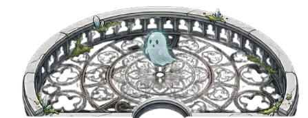
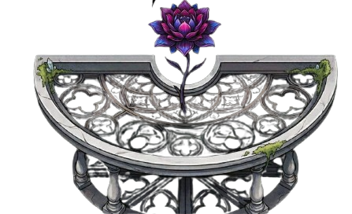
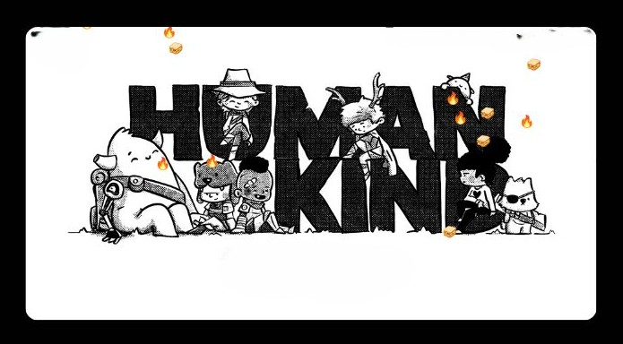

<div align="center">


<div align="center">



<details>
  <summary style="cursor: pointer; outline: none;">
    <b>OpEn</b>
  </summary>
  <br/>
</details>

</div>
  <!-- About Me -->
<div align="center">

## `whoami`

</div>

```python
class AI_Student_DS:
    def __init__(self):
        self.name        = "malini"
        self.role        = "AI & Data Science Student"
        self.location    = "🌍 Earth (mostly)"
        self.languages   = ["Python", "R", "SQL", "JavaScript", "C#"]
        self.interests   = ["Machine Learning", "Deep Learning", "NLP", "Generative AI"]
        self.vibe        = " Haunting datasets since forever"
        self.goal        = building things that think  # always
        self.coffee      = False

    def say_hi(self):
        print("Thanks for dropping by my  repo! 💜⚡")

me = AI_Student_DS()
me.say_hi()
```

## 🛠️ Tech Stack & Tools

<div align="center">

| | | | | | |
| :---: | :---: | :---: | :---: | :---: | :---: |
|  |  |  |  |  |  |
| `Python` | `TensorFlow` | `PyTorch` | `scikit-learn` | `Flask` | `FastAPI` |
| | | | | | |
|  |  |  |  |  |  |
| `JS` | `HTML` | `CSS` | `Three.js` | `C#` | `.NET` |
| | | | | | |
|  |  |  |  |  |  |
| `Java` | `Kotlin` | `Node.js` | `React` | `Flutter` | `WASM` |
| | | | | | |
|  |  |  |  |  |  |
| `Pandas` | `NumPy` | `Matplotlib` | `Jupyter` | `MySQL` | `Firebase` |
| | | | | | |
|  |  |  |  |  |  |
| `Git` | `GitHub` | `GitLab` | `Docker` | `Arduino` | `Anaconda` |
| | | | | | |
|  |  |  |  |  |  |
| `VS Code` | `Visual Studio` | `Figma` | `CodePen` | `Netlify` | `Streamlit` |

</div>
  
  ## 📈 GitHub Metrics Dashboard

  
  

  <br/>

  

  <br/>

  

  <br/>


  ## 🌌 Currently Haunting...

  | 👻 Project | 🧠 Stack | ⚡ Status |
  | :--- | :--- | :--- |
  | Smart Parking System | ESP32, Firebase, IoT | 🟢 Active |
  | Company Knowledge Base Portal | Flask, AI, Vector Search | 🟢 Active |
  | ECG Analyzer App | Python, ML | 🟢 Active |
  | Rubik Cube Solver | Three.js, JavaScript | 🟢 Active |
  | DIY Ventilator | Arduino, IoT | 🏆 Finalist |

</details>

<br/>


<p align="center">
  
</p>

</div>
<br></br>

## Contribution Snake

<div align="center">

<picture>
  <source media="(prefers-color-scheme: dark)" srcset="https://raw.githubusercontent.com/maliniaids-stack/maliniaids-stack/output/github-contribution-grid-snake-dark.svg">
  <source media="(prefers-color-scheme: light)" srcset="https://raw.githubusercontent.com/maliniaids-stack/maliniaids-stack/output/github-contribution-grid-snake.svg">
  
</picture>

</div>


</div>

<div align="center">

##  Find Me

[](https://www.linkedin.com/in/malini-s-8a2601300)
[](mailto:malini.aids@gmail.com)
[](https://malinisportfolio.netlify.app/)

</div>
